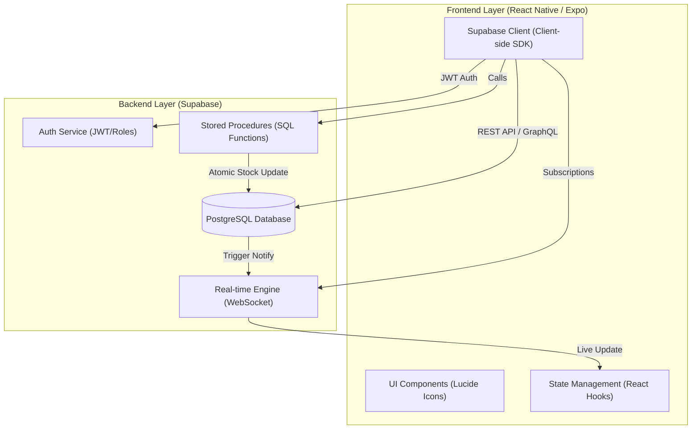

# System Architecture - Dine Flow

This document outlines the technical architecture of the Dine Flow Restaurant Management System.

## 🏗️ High-Level Overview

Dine Flow is built on a **Serverless Mobile Architecture**, leveraging React Native for a cross-platform frontend and Supabase as a comprehensive Backend-as-a-Service (BaaS).

## 🛠️ Tech Stack Details

### 1. Frontend: Mobile Client
- **Framework**: React Native with Expo (SDK 49+).
- **Styling**: Vanilla React Native StyleSheet for performance and native feel.
- **Icons**: Lucide-React-Native for minimalist, premium UI.
- **Role Switching**: Dynamic conditional rendering based on the `Profile` role (`admin`, `waiter`, `kitchen`).

### 2. Backend: Supabase (BaaS)
- **Database**: PostgreSQL hosted on Supabase. Uses **Row Level Security (RLS)** to enforce multi-tenancy.
- **Real-time**: Postgres CDC (Change Data Capture) is used to push new orders to the Kitchen Display System (KDS) instantly.
- **Auth**: Manages user sessions and links them to specific `hotel_id` records in the `profiles` table.

### 3. Logic Layer: SQL Stored Procedures
To ensure consistency and prevent race conditions (especially for inventory), critical logic is handled inside the database via PL/pgSQL:
- **`decrement_menu_item_stock`**: Atomically reduces stock during order placement.
- **`increment_menu_item_stock`**: Atomically returns stock during order/item cancellation.
- **`create_profile_v1`**: Securely handles staff onboarding.

---

## 🛰️ Data Flow Diagram

1.  **Waiter** places an order -> `Supabase Client` sends data to `orders` table.
2.  **PostgreSQL Trigger** (via Realtime) -> Broadcasts new order to all listening **Kitchen** devices.
3.  **Kitchen** marks item as served -> `Supabase Update` -> **Waiter** view reflects "Served" status instantly.
4.  **Inventory Logic** -> Order insertion triggers an RPC call to decrement `stock_count` numerically.

---

## 📅 Architectural Summary

The system is designed for **High Availability** and **Low Latency**. By offloading inventory logic to PostgreSQL functions and using WebSocket-based Real-time sync, the app ensures that multiple waiters and chefs can work simultaneously without data conflicts or "ghost" orders.

